# Altnautica Mission Control

**Open-source web GCS for software-defined drones. ArduPilot, PX4, and Betaflight. AI tuning. 50km+ data link. Full gamepad flight control.**

    [](https://discord.gg/uxbvuD4d5q)

Command any drone from any browser. ADOS Mission Control is a full-stack ground control station built for software-defined drones. Configure 38 flight controller panels, plan missions with 7 pattern generators, fly with a gamepad at 50Hz, and tune PIDs with AI. No install. No locked hardware. 98,000 lines of TypeScript.

> **Part of the ADOS ecosystem.** Pairs with [ADOS Drone Agent](https://github.com/altnautica/ADOSDroneAgent) (the onboard companion OS) for 50km data link, HD video, and cloud fleet management. Works standalone with any MAVLink drone over USB or WebSocket.

<p align="center">
  <strong><a href="https://command.altnautica.com">Live App</a></strong> |
  <strong><a href="https://command.altnautica.com/community/changelog">Changelog</a></strong> |
  <strong><a href="https://discord.gg/uxbvuD4d5q">Discord</a></strong> |
  <strong><a href="mailto:team@altnautica.com">Email</a></strong> |
  <strong><a href="https://command.altnautica.com/community/contact">Contact</a></strong>
</p>

---

<p align="center">
  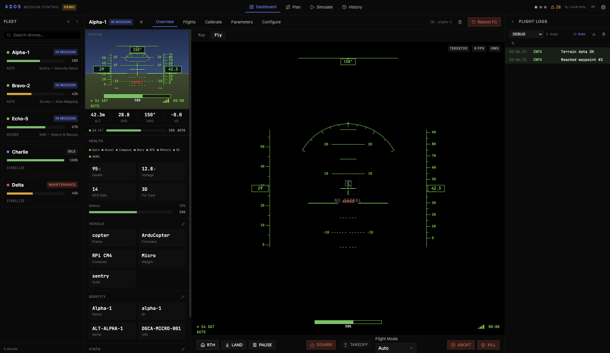
</p>

---

<table>
  <tr>
    <td width="50%">
      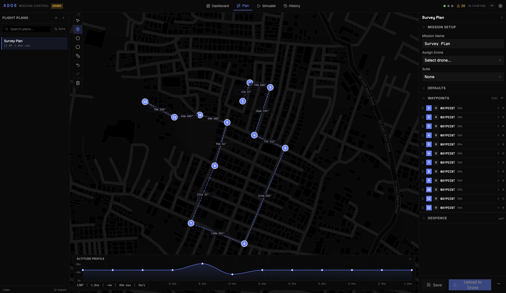<br>
      <sub>Mission planning with 7 pattern generators and terrain following</sub>
    </td>
    <td width="50%">
      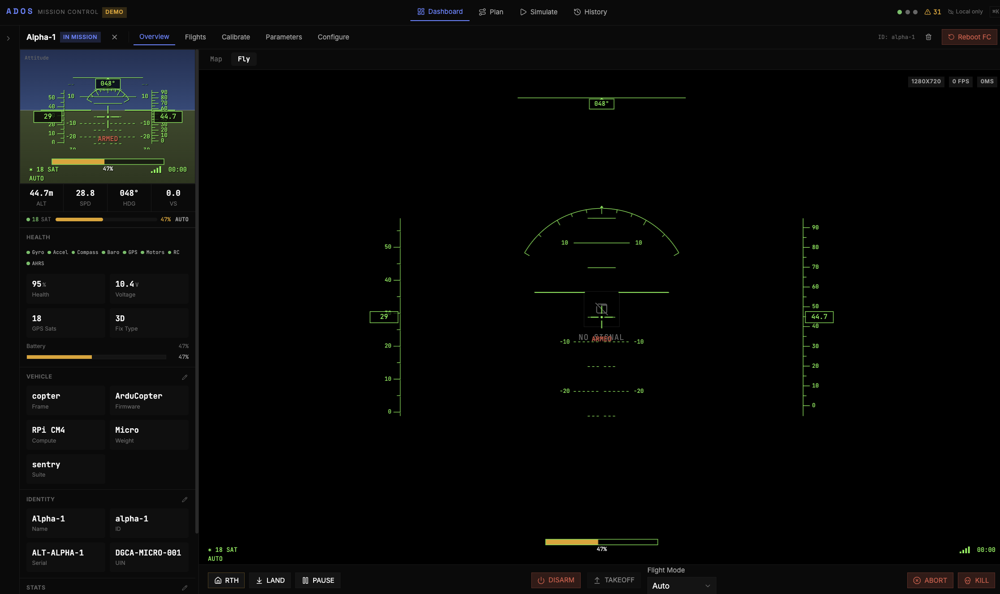<br>
      <sub>Gamepad and HOTAS flight controls at 50Hz</sub>
    </td>
  </tr>
  <tr>
    <td width="50%">
      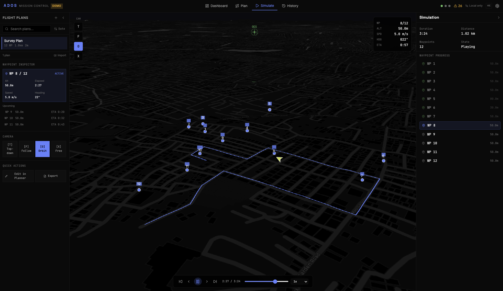<br>
      <sub>Cesium 3D globe with real terrain and flight path replay</sub>
    </td>
    <td width="50%">
      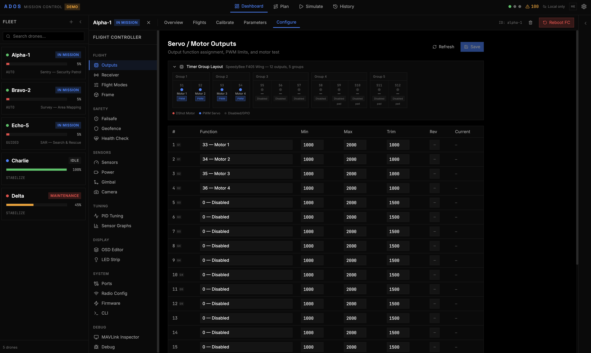<br>
      <sub>38 panels for full flight controller setup</sub>
    </td>
  </tr>
  <tr>
    <td width="50%">
      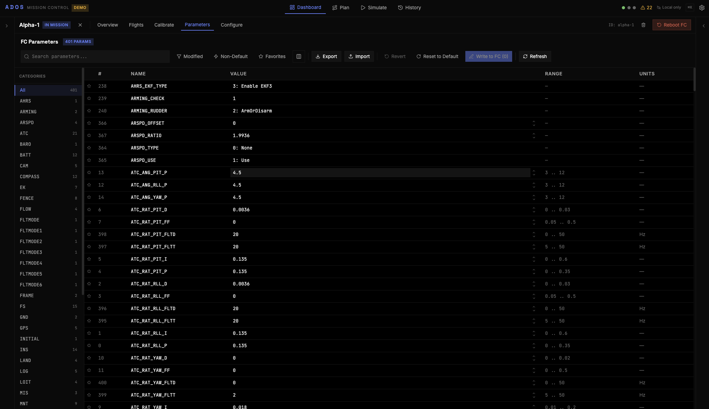<br>
      <sub>Search, edit, and write all FC parameters</sub>
    </td>
    <td width="50%">
      <br>
      <sub>WebUSB firmware flashing, no external flasher needed</sub>
    </td>
  </tr>
  <tr>
    <td width="50%">
      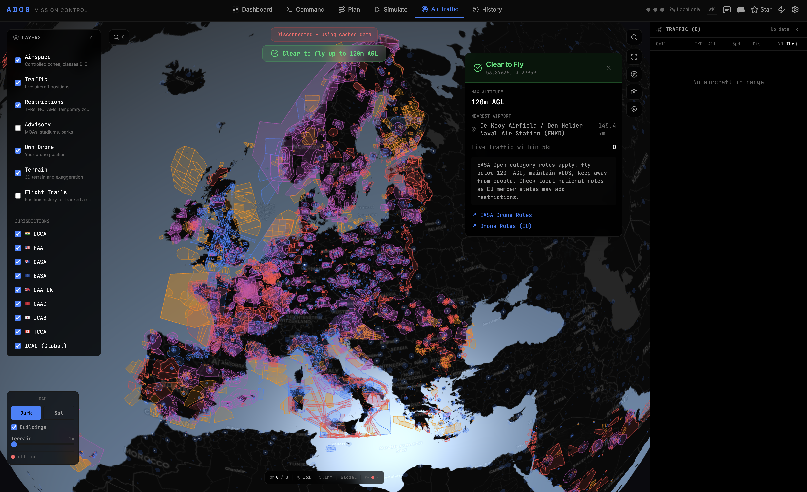<br>
      <sub>Live ADS-B tracking on a 3D CesiumJS globe with airspace zone visualization and flyability assessment</sub>
    </td>
    <td width="50%">
      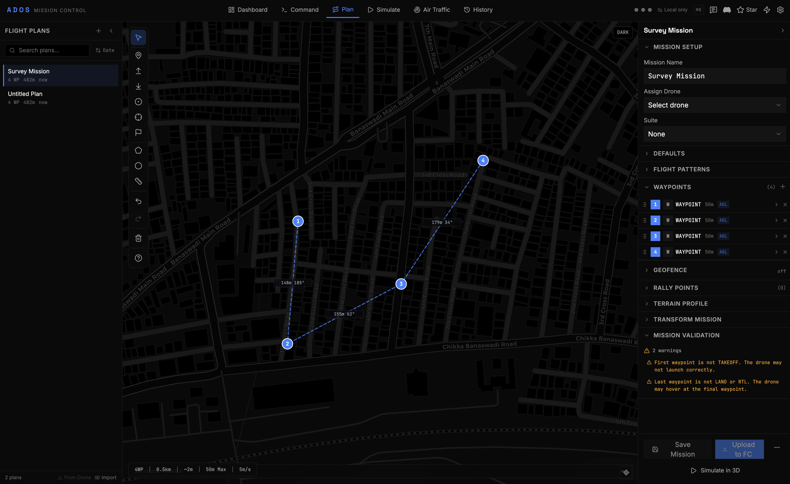<br>
      <sub>Drag-and-drop waypoint editor with terrain profile, mission validation, and pattern generators</sub>
    </td>
  </tr>
  <tr>
    <td width="50%">
      <br>
      <sub>Built-in Python script editor with syntax highlighting for drone automation scripts</sub>
    </td>
    <td width="50%">
      <br>
      <sub>Real-time agent monitoring with service status, system resources, and live logs</sub>
    </td>
  </tr>
  <tr>
    <td width="50%">
      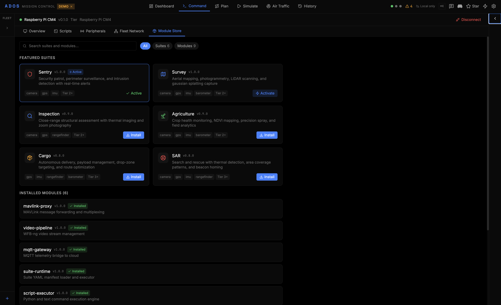<br>
      <sub>Module store with 6 application suites: Sentry, Survey, Inspection, Agriculture, Cargo, SAR</sub>
    </td>
    <td width="50%">
      <br>
      <sub>DroneNet fleet enrollment, MQTT gateway status, mesh radio peers, and network topology</sub>
    </td>
  </tr>
  <tr>
    <td width="50%">
      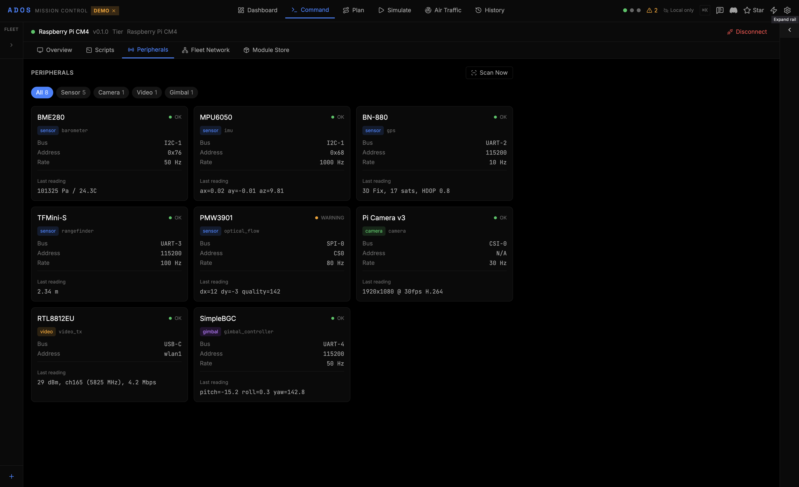<br>
      <sub>Connected peripheral detection with live sensor readings (IMU, GPS, barometer, camera, radio)</sub>
    </td>
    <td width="50%">
      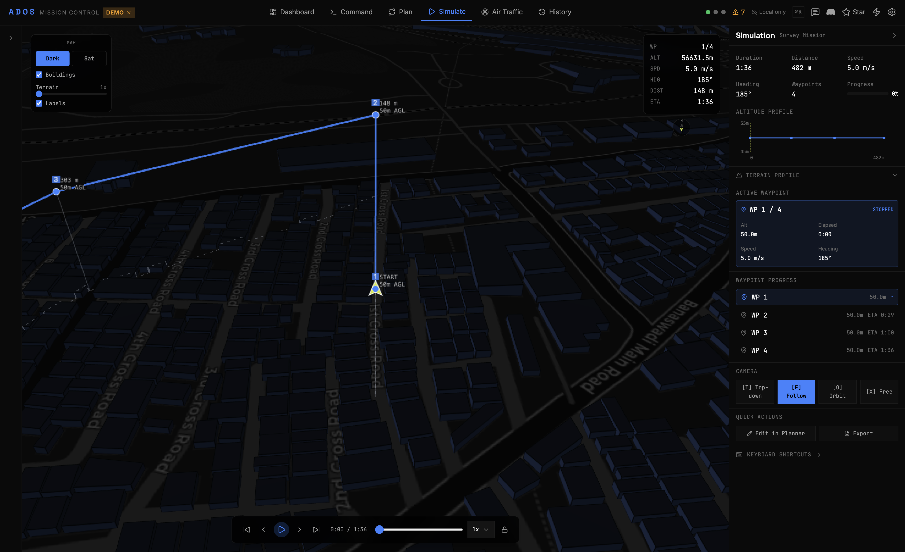<br>
      <sub>3D mission simulation with waypoints over terrain, playback controls, and camera presets</sub>
    </td>
  </tr>
</table>

---

## Quick Start

Try it right now at [command.altnautica.com](https://command.altnautica.com). No install needed. Demo mode loads 5 simulated drones with live telemetry, mission planning, and full FC configuration.

Or run locally:

```bash
git clone https://github.com/altnautica/ADOSMissionControl.git
cd ADOSMissionControl
npm install
npm run demo
```

Open [http://localhost:4000](http://localhost:4000). Five simulated drones. No hardware required.

---

## Why ADOS Mission Control

| | ADOS Mission Control | QGroundControl | Mission Planner | Betaflight Configurator |
|---|---|---|---|---|
| **Platform** | Browser (any OS) | Desktop (Qt) | Desktop (Windows/.NET) | Browser (Chrome) |
| **Firmware** | ArduPilot + PX4 + Betaflight | ArduPilot + PX4 | ArduPilot only | Betaflight only |
| **Protocol** | MAVLink v2 + MSP v1/v2 | MAVLink v2 | MAVLink v1/v2 | MSP |
| **Flight control** | Gamepad/HOTAS at 50Hz | Joystick (limited) | Joystick (limited) | No |
| **AI tuning** | Yes (PID + filter analysis) | No | No | No |
| **3D simulation** | CesiumJS globe | No | No | No |
| **Air traffic** | Live ADS-B + airspace zones | No | Yes (basic) | No |
| **Cloud fleet** | Yes (MQTT + Convex relay) | No | No | No |
| **Self-hosted** | Yes (Convex + MQTT + video) | N/A | N/A | N/A |
| **License** | GPL-3.0 | Apache 2.0 / GPL-3.0 | GPL-3.0 | GPL-3.0 |

---

## What It Does

### Configure your flight controller

38 panels covering calibration, PID tuning, receiver, outputs, failsafe, power, ports, OSD, and firmware flashing. Works with ArduPilot, PX4, and Betaflight. **AI PID tuning** analyzes FFT noise and motor health, then suggests filter settings and PID values. Board auto-detection for 9 STM32 profiles. WebUSB firmware flashing with no external tools.

### Plan missions

Drag waypoints on an interactive map. 7 pattern generators: survey (boustrophedon), orbit, corridor, SAR (expanding square, sector, parallel track), structure scan. Terrain following via Open Elevation API. Geofence editor, rally points, batch waypoint editing, and mission validation before upload. Import/export KML, KMZ, CSV, `.waypoints`, `.plan`.

### Fly and simulate

Gamepad, HOTAS, RC transmitter, or keyboard input at 50Hz. Arm/disarm, mode switching, guided flight, mission execution, kill switch. 3D Cesium globe simulation with real terrain, flight path replay, and camera presets. Live ADS-B traffic via adsb.lol and OpenSky. Airspace flyability assessment for India, USA, and Australia.

### Monitor telemetry

Real-time attitude, GPS, battery, EKF status, vibration, RSSI, and sensor health. Pre-arm check visualization. Alert feed from the flight controller. Ring-buffered stores keep memory bounded across long sessions.

### Connect over the cloud

Works standalone in field mode (direct WebSocket or WebSerial). Cloud mode adds fleet management, mission sync, and MQTT telemetry relay. When paired with ADOS Drone Agent, the GCS receives live telemetry at 2Hz+ and can send commands through a three-layer relay: Convex HTTP (baseline), MQTT real-time, and WebSocket video streaming.

---

## Firmware Support

| Firmware | Protocol | Status |
|----------|----------|--------|
| ArduPilot (Copter / Plane / Rover / Sub) | MAVLink v2 | Full |
| PX4 | MAVLink v2 | Full |
| Betaflight | MSP v1/v2 | Full |
| iNav | MSP v1/v2 | Planned |

---

## By the Numbers

~98K lines of TypeScript. 38 FC panels. 83 MAVLink decoders. 34 MSP decoders. 7 pattern generators. 34 Zustand stores. 9 board profiles. Full demo mode with zero setup.

---

## Platform Support

| Platform | Requirements | Notes |
|----------|-------------|-------|
| Web (recommended) | Chrome 89+ or Edge 89+ | WebSerial + WebUSB for FC connection and firmware flashing |
| Web (limited) | Firefox, Safari | No WebSerial or WebUSB. WebSocket connections work. |
| Desktop (macOS) | Intel or Apple Silicon | Electron app, not code-signed (same as Betaflight/INAV Configurator) |
| Desktop (Windows) | x64 | Electron app, `.exe` installer |
| Desktop (Linux) | x64 or arm64 | `.AppImage` |

3D features (simulation, air traffic) benefit from a dedicated GPU. Works without one but frame rates will be lower.

---

## External Services

All optional. The GCS works fully offline for local FC configuration and field operations.

| Service | Purpose | Required? |
|---------|---------|-----------|
| [Convex](https://convex.dev) | Cloud fleet management, auth, community features | No (field mode works without) |
| [Open Elevation](https://open-elevation.com) | Terrain following for mission planning | No (defaults to flat terrain) |
| [adsb.lol](https://adsb.lol) | Live ADS-B aircraft positions | No (Air Traffic tab only) |
| [OpenSky Network](https://opensky-network.org) | Fallback ADS-B source | No |
| [Cesium Ion](https://cesium.com/ion) | 3D terrain tiles and satellite imagery | No (uses ArcGIS terrain by default) |
| [Groq](https://console.groq.com) | AI PID tuning analysis | No (AI features disabled without key) |
| [GitHub API](https://github.com) | PX4 firmware release fetching | No (raises rate limit from 60 to 5000/hr) |
| [OpenAIP](https://www.openaip.net) | Airspace polygon data | No (Air Traffic tab only) |

---

## Tech Stack

| Layer | Technology |
|-------|-----------|
| Framework | Next.js 16 (App Router, Turbopack) |
| UI | React 19, Tailwind v4 |
| State | Zustand 5 (ring-buffered telemetry) |
| Maps | Leaflet + react-leaflet |
| 3D / Airspace | CesiumJS |
| Protocol | Custom MAVLink v2 + MSP v1/v2 binary parsers |
| Transport | WebSocket, WebSerial, WebUSB |
| Backend | Convex (optional, cloud fleet and community features) |
| Desktop | Electron |
| Language | TypeScript (strict) |

---

## CLI

```bash
npm run cli              # Interactive menu
npm run cli dev          # Dev server (port 4000)
npm run cli demo         # Demo mode — 5 simulated drones
npm run cli sitl         # Launch ArduPilot SITL + WebSocket bridge
npm run cli deploy       # Lint → build → start
npm run cli setup        # First-time setup wizard
npm run cli config       # Configure .env.local interactively
```

---

## Connecting to Hardware

**WebSocket:** Connect to any MAVLink-over-WebSocket endpoint. Use `npm run cli sitl` to launch ArduPilot SITL with the bridge tool. See [`tools/sitl/`](tools/sitl/).

**WebSerial (USB):** Plug in your FC, open Mission Control in Chrome 89+, click connect, pick the port. No drivers needed.

---

## Desktop App

```bash
npm run desktop:build:mac   # macOS .dmg
npm run desktop:build:win   # Windows .exe installer
npm run desktop:build:linux # Linux .AppImage
```

macOS: right-click the app, Open, then Open again. Not code-signed, same as Betaflight Configurator and INAV Configurator.

---

## Backend and Cloud Features

Field mode works with no backend. Cloud features need a Convex deployment:

```bash
npx convex init
npx @convex-dev/auth
npx convex dev
```

Set `NEXT_PUBLIC_CONVEX_URL` in `.env.local`. The first user to sign up becomes admin.

For self-hosted MQTT and video relay, see [`tools/mqtt-bridge/`](tools/mqtt-bridge/), [`tools/video-relay/`](tools/video-relay/), and [SELFHOSTING.md](SELFHOSTING.md).

### Environment variables (`.env.local`)

| Variable | Description |
|----------|-------------|
| `NEXT_PUBLIC_DEMO_MODE` | Enable demo mode with 5 simulated drones |
| `NEXT_PUBLIC_CONVEX_URL` | Convex backend URL for cloud fleet features |
| `GROQ_API_KEY` | AI PID tuning suggestions. Free at [console.groq.com](https://console.groq.com) |
| `GITHUB_TOKEN` | Raises PX4 releases API limit from 60 to 5000 req/hr |

### Tools

| Tool | Path | Description |
|------|------|-------------|
| SITL launcher | `tools/sitl/` | ArduPilot SITL + TCP-to-WebSocket bridge |
| MQTT bridge | `tools/mqtt-bridge/` | Mosquitto broker + MQTT-to-Convex bridge (Docker Compose) |
| Video relay | `tools/video-relay/` | RTSP-to-WebSocket fMP4 relay via ffmpeg (Docker Compose) |

---

## Community

- **[Discord](https://discord.gg/uxbvuD4d5q)** — Join the community, ask questions, share builds
- **[Email](mailto:team@altnautica.com)** — team@altnautica.com
- **[Changelog](https://command.altnautica.com/community/changelog)** — What shipped and when
- **[GitHub Issues](https://github.com/altnautica/ADOSMissionControl/issues)** — Bug reports and technical discussions

---

## Contributing

See [CONTRIBUTING.md](CONTRIBUTING.md) for the full guide. Good areas to start: iNav MSP support, Betaflight hardware testing, new board profiles, UDP transport, unit tests, pattern generators.

```bash
npm run demo   # Test against simulated drones
npm run lint   # Must pass before PR
```

---

## License

[GPL-3.0-only](LICENSE). Copyright 2025-2026 Altnautica. Derivative works must also be GPL-3.0, same as ArduPilot.
